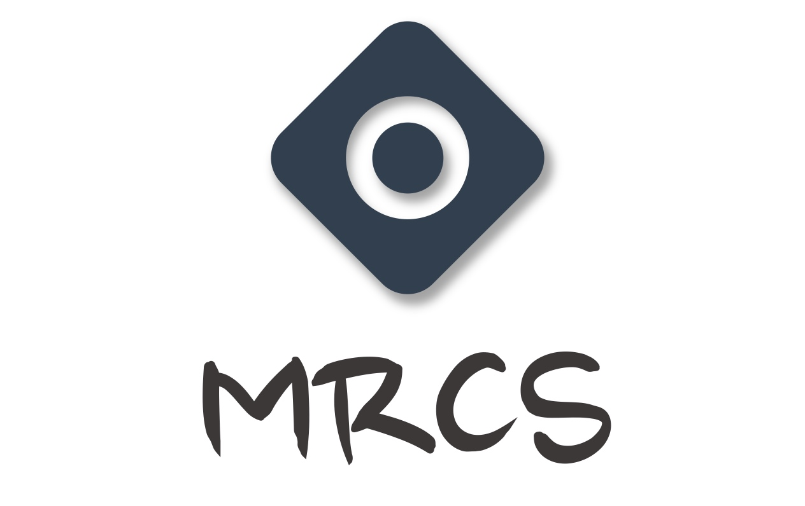

[](https://github.com/GavinSun0921/MRCS)
[](https://github.com/GavinSun0921/MRCS)
[](https://github.com/GavinSun0921/MRCS)
[](https://github.com/GavinSun0921/MRCS)

## 介绍

MRCS（Multiparticle Radiation Counting Simulator）是一个多粒子放射计数的虚拟仿真器，在医学放射领域用于测量与定位患者头部的肿瘤课题的基础工具库。对于已知单一粒子放射效果的情况下，模拟多粒子的辐射效果，并对辐射效果计数。

## 环境

C++14及之后的版本

- [C++编译器支持情况表](https://zh.cppreference.com/w/cpp/compiler_support)
- [C++ Compiler Support](https://en.cppreference.com/w/cpp/compiler_support)

额外的头文件

- unistd.h

## 支持

 - [x] 二维空间中多粒子模拟
 - [x] 三维空间中多粒子模拟
 - [x] 阶乘连续化
 - [ ] 更加方便的单粒子参数设置 - Canceled
 - [ ] 使用`Python`调用本项目进行计算 - Canceled

## 样例演示（3D）

```C++
#include "Simulator3D.h"

int main() {
    // 创建一个Field容器。
    Simulator3D::Field field;

    // 放入两个点，
    // 点一坐标为(1,1,1)，浓度为1，
    // 点二坐标为(3,3,3)，浓度为1。
    field.addPoint(1, 1, 1, 1);
    field.addPoint(3, 3, 3, 1);

    // 计算前的准备工作，使所有的点都尽量的靠近计算空间的中心。
    field.prepare();

    // 计算三维矩阵中每个单元格的辐射计数。
    // 计算空间中的三维矩阵维度是由'MAX_RESOLUTION'定义的，
    // 其在文件'Simulator3D.h'中。
    field.calculate();

    // 获得三维矩阵(0,0,0)位置的辐射计数。
    std::cout << field.getCnt(0, 0, 0) << std::endl;

    // 获得x=250这个平面的辐射计数，其输出的是一个n*n的平面。
    // 结果将会以文件的形式保存在本地，并在命令行中会现实文件的地址。
    field.outputX(250);
    // 你也可以指定文件保存的地址，但要求地址具体到文件名，如下,
    // field.outputX("D:/pathdemo/data.txt", 250);
    // 结果会保存在"D:/pathdemo/data.txt"文件中。

    // 获得所有从y方向上切片
    for (int i = 0; i < field.getMAX_RESOLUTION(); i++) {
        field.outputY(i);
    }

    return 0;
}
```

## 联系方式

Email: [gavinsun0921@foxmail.com](mailto:gavinsun0921@foxmail.com)
