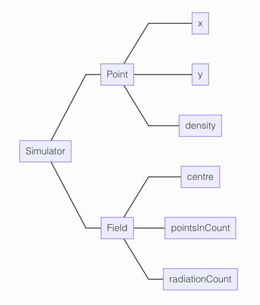
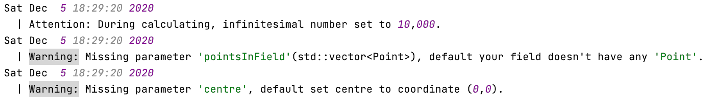

# Multi particle radiation simulator

## Introduction

Simulation of multi particle radiation counting.

## Structure


## Environment

C++14 or later version.

## Usage

### 1. Set fitting curve function

In file `ProjectDirectory*/Calculator.cpp`, change function `calculate_with_density_*()` to what you want.

For example, with density 1, I want `sin(x)`.

change
```C++
double Calculator::calculate_with_density_1(double dist) {
    return 0;
}
```
to
```C++
double Calculator::calculate_with_density_1(double dist) {
    return std::sin(dist);
}
```

### 2. Creat a 'Field'

Like my demo in the `ProjectDirectory*/main.cpp`.

```C++
Simulator::Field field;
```

After this step, your log file should have these details.



### 3. Add 'Point' to your 'Field'

Like my demo in the `ProjectDirectory*/main.cpp`.

```C++
field.addPoint(1, 2, 1); // (x, y, density);
```
or you could omit 'density', it will be set to 0.

After this step, your log file should have these details.


### 4. Get Radiation Count

Like my demo in the `ProjectDirectory*/main.cpp`.

```C++
field.getRadiationCount(1);
```
It will return the radiation count by a circular with 'center' as the center and 'r' as the radius.

### 5*. Set centre

If you need move the 'centre' in your 'Field', you could use this statement like my demo in the `ProjectDirectory*/main.cpp`..

```C++
field.setCentre(0, 0); // (x, y);
```

## Contact
Email: [gavinsun0921@foxmail.com](gavinsun0921@foxmail.com)