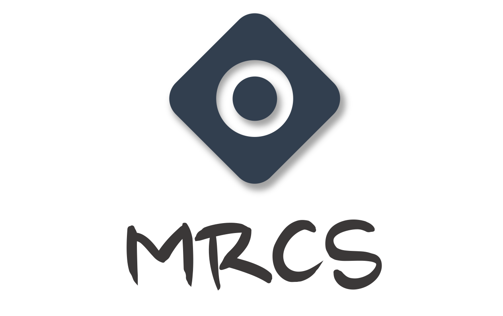

## 介绍

MRCS（Multiparticle Radiation Counting Simulator）是一个多粒子放射计数的虚拟仿真器，对于已知单一粒子放射效果的情况下，模拟多粒子的辐射效果，并对辐射效果计数。

## 环境

C++14及之后的版本

- [C++编译器支持情况表](https://zh.cppreference.com/w/cpp/compiler_support)
- [C++ Compiler Support](https://en.cppreference.com/w/cpp/compiler_support)

## 支持

 - [x] 二维空间中多粒子模拟
 - [x] 三维空间中多粒子模拟
 - [x] 阶乘连续化
 - [ ] 更加方便的单粒子参数设置 - Pending
 - [ ] 使用`Python`调用本项目进行计算 - Pending

## 联系方式

Email: [gavinsun0921@foxmail.com](mailto:gavinsun0921@foxmail.com)